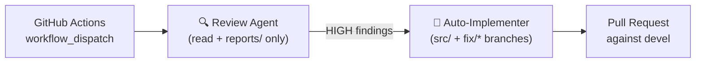
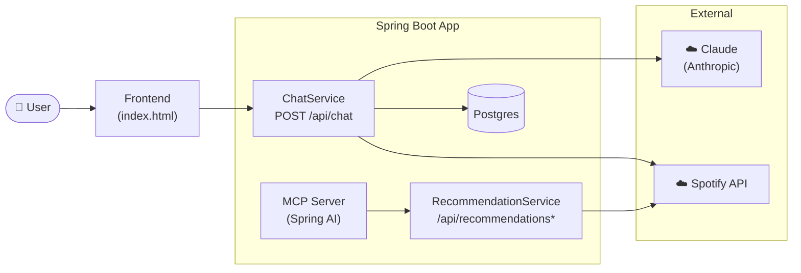

# Fractals

> Discover music that means something to you.

## Background

I built Fractals to learn a specific set of AI 
tools — Claude Code, agentic pipelines, and MCP — 
using a real problem as the test case. The problem: 
Spotify's recommendations have always felt too safe. 
They tell you what you already know you like, not 
what you might love next.

What started as a learning exercise produced 
something I didn't expect: recommendations that 
actually surprised me. Not just "more of the same 
genre" but genuine discoveries — artists from 
completely different cultural traditions that shared 
the same emotional DNA as music I already loved.

That outcome is what this README documents.

## What it is

Fractals is a music discovery app. You describe 
what you're looking for in plain language — Claude 
reasons about the emotional intent behind your words 
— and surfaces tracks that feel right, often from 
directions you wouldn't have thought to look. 
Spotify history is taste context, not the driver.

## Why it's different

Most music tools are history-based. They know what 
you played. Fractals tries to understand what you're 
looking for.

The difference shows up in three ways:

**Stay within a genre, but find something new.** 
Ask for Classic Rock, Hip-Hop, or Indie Folk — 
Fractals finds artists and tracks within that space 
that you haven't heard, rather than recommending 
what you already know.

**Follow an emotional thread across genres.**
Ask for something like your Jazz playlist and 
instead of more Jazz, Fractals identifies the 
emotional thread — for example: late-night intimacy, 
unhurried tempo, acoustic warmth — and surfaces 
artists from a completely different tradition 
that should feel immediately right.

**Ask in plain language.**
Describe a feeling rather than a genre — 
"music for a rainy Sunday morning" or 
"something that feels like the last day of summer" 
— and Fractals should return a playlist that 
matches that feeling and your music taste, 
not just a generic playlist.

Spotify knows what you've listened to. Fractals 
understands why it resonated — and tries to find 
more music that does.
[review-log.md](reports/review-log.md)
## How it works

User logs in via Spotify OAuth2, then sends a 
plain-text query. The service fetches music context 
from Spotify (top tracks, playlist contents), 
constructs a prompt combining that context with 
reasoning guidelines, and calls the Anthropic API.

Claude identifies an emotional thread in the user's 
taste and suggests tracks from unexpected directions. 
The service resolves each suggestion against Spotify's 
catalogue, saves confirmed tracks to a Fractals 
playlist (with deduplication), and returns the 
results to the frontend.

## The AI pipeline



This repo ships a two-agent pipeline triggered manually via GitHub Actions workflow_dispatch. Both agents operate under Engineering Principles and security constraints defined in CLAUDE.md.

**Review Agent** reads the diff, runs `mvn compile` and `mvn test`, and writes a structured
findings report to `reports/` with each finding graded HIGH / MEDIUM / LOW against five
engineering principles: least privilege, defence in depth, fail safe, auditability, and no
silent degradation.

**Auto-Implementer** fires automatically when a report contains a HIGH finding. It checks out
a `fix/auto-YYYY-MM-DD` branch, implements the fix, runs the full test suite, and opens a PR
against `devel`.

Both agents operate under explicit tool allowlists — the Review Agent is least-privilege: it
reads source files and writes only to `reports/` to commit the review report; the
Auto-Implementer can write to `src/` and `reports/` only, and can push only to `fix/*` branches.

*The pipeline runs autonomously — agents operate without human supervision until a PR is ready
for review.*

## Architecture



*MCP integration for /api/recommendations is in progress — currently the endpoint fetches Spotify data directly. See CLAUDE.md for details.*

## Tech stack

- **Java 21**, Spring Boot 3.4, Maven
- **Anthropic SDK** — conversational chat and recommendation reasoning via Claude
- **Spring AI** — MCP server exposing read-only Spotify tools
- **Spring Security OAuth2** — Spotify Authorization Code Flow, CSRF double-submit cookie
- **WebClient** (WebFlux) inside a servlet (MVC) app — all Spotify calls `.block()` at the service layer
- **Spring Data JPA** + `JdbcOAuth2AuthorizedClientService` — Postgres for users and token storage
- **Postgres 16** (Docker in dev)
- **OpenAI API** — text-embedding-3-small for semantic embeddings (built, currently disabled pending privacy review)
- **pgvector** — Postgres extension for vector similarity search (built, currently disabled pending privacy review)

## Running locally

**Prerequisites:** Java 21, Maven 3.9+, Docker, a Spotify developer app, an Anthropic API key.

```bash
# Start the dev database (pgvector/pgvector:pg16 required — includes pgvector extension)
docker run --name fractals-db \
  -e POSTGRES_PASSWORD=${DB_PASSWORD} \
  -e POSTGRES_DB=fractals \
  -e POSTGRES_USER=${DB_USER} \
  -p 5432:5432 -d pgvector/pgvector:pg16

# Option A — .env file (recommended for local dev)
# Copy .env.example to .env and fill in your values; spring-dotenv loads it automatically.
cp .env.example .env   # then edit .env with your credentials

# Option B — export manually (PowerShell: $env:VAR = "value")
export SPOTIFY_CLIENT_ID=your-client-id
export SPOTIFY_CLIENT_SECRET=your-client-secret
export ANTHROPIC_API_KEY=your-anthropic-api-key
export OPENAI_API_KEY=your-openai-api-key   # Required if re-enabling RAG pipeline (currently disabled — see CLAUDE.md)
export DB_USER=your_db_user
export DB_PASSWORD=your_db_password

mvn spring-boot:run -Dspring-boot.run.profiles=dev
```

Open `http://127.0.0.1:8080` — use `127.0.0.1`, not `localhost`. The Spotify redirect URI is
registered to `127.0.0.1`; a `localhost` session won't carry over to the OAuth callback.

> **Windows (PowerShell):** replace `export VAR=value` with `$env:VAR = "value"` and
> backslash line continuations with a backtick.

## Running tests

```bash
mvn test
```

Self-contained — MockWebServer for Spotify API calls, Mockito for the service layer. No
Spotify credentials or live database needed.

### Test strategy

The test suite (126 tests) covers:

- **MockWebServer** (OkHttp) for all Spotify API calls —
  tests run without Spotify credentials or network access
- **Mockito** for the service layer — ChatService,
  RecommendationService, and SpotifyApiService are
  tested in isolation
- **Reflection test** — enforces that all MCP tools
  are read-only at the tooling layer, independent of
  the prompt instructions (defence in depth)
- **Bounded regression test** — the playlist pagination
  loop has a harness that fails fast with AssertionError
  if called more than N times, so a non-terminating
  loop fails the test suite rather than hanging it
- **@WebMvcTest slices** — controller tests use Spring's
  test slices with no real datasource, keeping them fast
  and self-contained

## Development approach

Built using Claude Code as an AI development partner, with all architectural decisions,
security design, and product direction driven by the developer.

This represents an emerging development methodology: AI handles implementation, human
judgment drives architecture, security, and product decisions.

Key human decisions include:

- MCP server architecture and security model
- Engineering Principles (least privilege, defence in depth, fail safe, auditability)
  applied throughout
- Multi-Agent GitHub Actions pipeline design
- Prompt engineering approach for semantic music discovery
- All code reviewed and approved before execution

### CLAUDE.md

`CLAUDE.md` in the project root serves two purposes:

- **Persistent memory** for AI-assisted development
  sessions — Claude Code reads it at the start of
  every session to understand the architecture,
  conventions, and decisions already made
- **Engineering Principles** — defines the five
  principles (least privilege, defence in depth,
  fail safe, auditability, no silent degradation)
  that the Review and Auto-Implementer agents
  audit and enforce when the pipeline is triggered

## Spotify app setup

Register at [developer.spotify.com/dashboard](https://developer.spotify.com/dashboard) and
add exactly this redirect URI:

```
http://127.0.0.1:8080/login/oauth2/code/spotify
```

**Apps created after Nov 27, 2024:** Spotify deprecated `/v1/recommendations` and
`/v1/audio-features` for new apps. Fractals uses Claude directly for all recommendations —
no dependency on these deprecated endpoints.

## Access control & cost management

Fractals uses Spotify's built-in Development Mode
as an invite gate. By default, Spotify apps in
Development Mode only allow logins from users
explicitly added in the Spotify Developer Dashboard
— no code changes required.

**Why this matters:** Every recommendation request
makes calls to the Anthropic Claude API, which is
billed per token. Leaving the app open to anonymous
traffic would incur unbounded API costs. The Spotify
Development Mode gate ensures only invited users
can access the app.

**Adding a tester:**
1. Go to your app in the
   [Spotify Developer Dashboard](https://developer.spotify.com/dashboard)
2. Settings → User Management
3. Add the user's Spotify email address
4. They can now log in - up to 25 users in
   Development Mode, no code changes needed

**What non-invited users see:**
If a user tries to log in without being on the
allowlist, Spotify returns an access_denied error.
Fractals catches this and shows a friendly
invite-only page rather than a raw error —
keeping the experience clean even for users
who aren't yet invited.

**Scaling beyond 25 users:**
To open the app to more users, submit a Quota
Extension Request in the Spotify Developer Dashboard.
This is the natural next step after invite-only
alpha testing validates the product.
